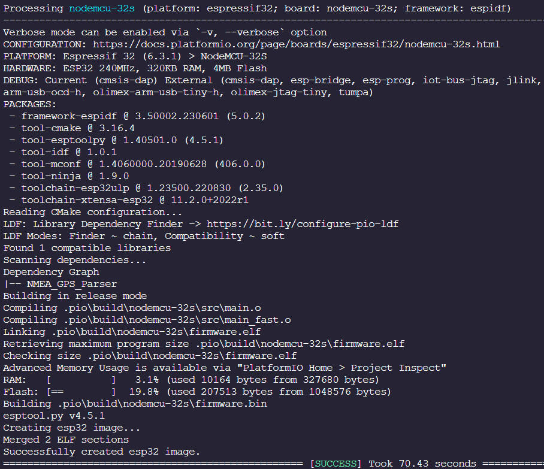
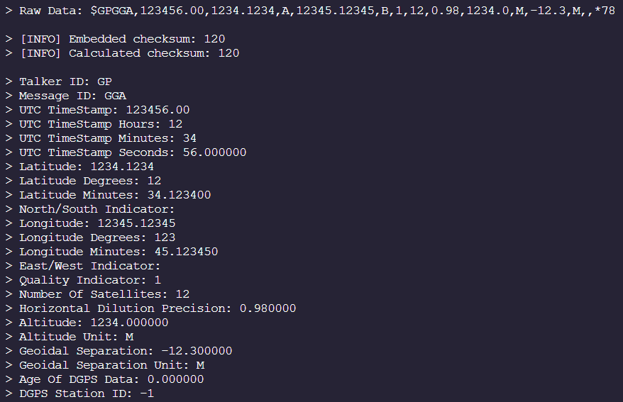
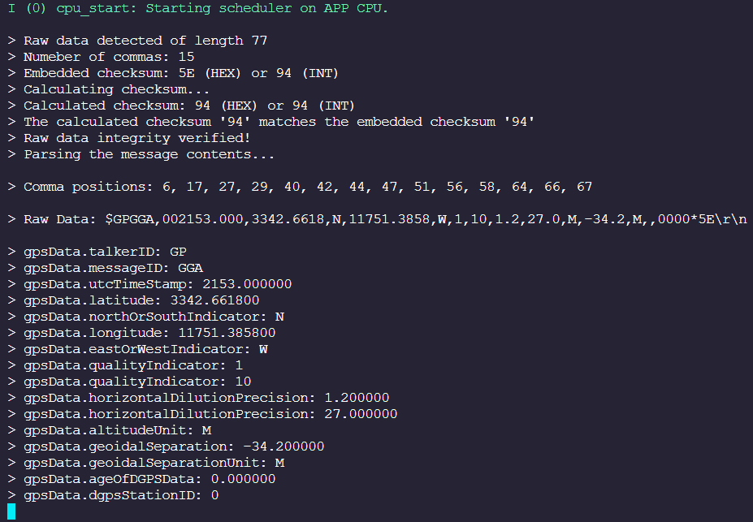

# NMEA GPS Data Parser

## Cowlar Design Studio Assessment (WIP)

### TODO: 

#### ✅ Functional Implementation
#### ✅ OOP Implementation
#### ✅ Basic Testing 
#### ⭕ Update Readme
#### ⭕ Add Unit Tests

 

### Example:

TODO: Brief explanation with pseudo code...

 

### Example:

    #include <stdio.h>
    #include <string>
    #include "nmea_gps_parser.hpp"

    using namespace std;

    extern "C" 
    {    
        void app_main(void);
    }

    void app_main() 
    {
        string gpsRawData = "$GPGGA,002153.000,3342.6618,N,11751.3858,W,1,10,1.2,27.0,M,-34.2,M,,0000*5E\r\n";

        printf("\n");
        printf(R"(> Raw Data: $GPGGA,002153.000,3342.6618,N,11751.3858,W,1,10,1.2,27.0,M,-34.2,M,,0000*5E\r\n)");
        printf("\n");

        NMEA_GPS_Parser gpsData(gpsRawData);

        if (gpsData.isParsingSuccessful() == true)
        {
            gpsData.printParsedData();
        }
        else
        {
            printf("\n> [ERROR] GPS raw data parsing failed!\n");
        }
    }

 

### Member Methods: 

    NMEA_GPS_Parser();
    NMEA_GPS_Parser(string rawData);
    void initializeParams();
    string getGPSRawData();
    void parseGPSRawData();
    void parseGPSRawData(string rawData);
    int findNumberOfCommas(string rawData, int commaPositions[]);
    bool verifyNMEACompliance(string rawData);
    int extractEmbeddedChecksum(string rawData);
    int calculateChecksum(string rawData);
    void extractGPSData(string rawData, int commaPositions[]);
    bool isParsingSuccessful();
    void printParsedData();

 

### Building and Running: 

    Building for NodeMCU-32S from PlatformIO (ESP-IDF v5.0.2):

    

 

    Parsing GPS data (printing over serial interface):

    

 

    Detailed output when using the functional version:

    

 

