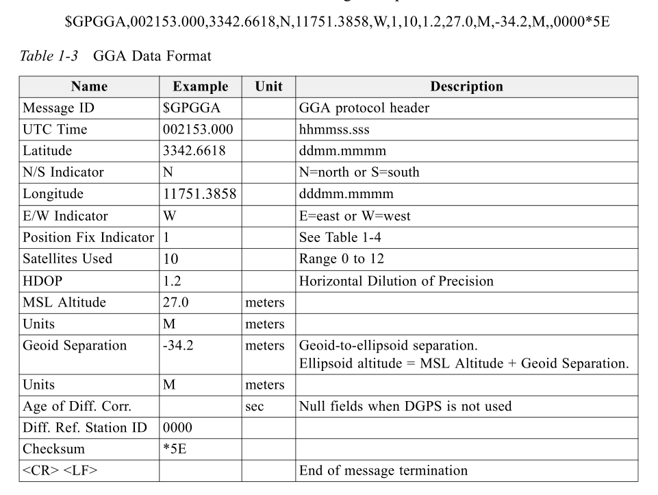

<h1 align="center">
    NMEA GPS Data Parser
</h1>

<h2 align="center">
    Cowlar Design Studio Assessment
    <h3 align="center">-----------------------------------------------</h3>
</h2>

This library uses a simple algorithm to parse a raw NMEA-0183 GPS-GGA message. A valid message has a maximum
length of 82 characters and contains 14 data points in an ordered sequence. Below is an example of a raw message:

    $GPGGA,002153.000,3342.6618,N,11751.3858,W,1,10,1.2,27.0,M,-34.2,M,,0000*5E\r\n

 

The message starts with "\$" character and ends with the carriage return "\r" and line feed "\n" characters. 
Each message has a two characters hexadecimal checksum which come after the "\*" character and before the 
"\r\n" characters. Everything in between the "\$" and "\*" characters is the GPS data that is extracted into 
separated variables. Here's all the 14 data points in the order they appear in the raw message:

1. UTC TimeStamp
2. Latitude
3. North/South Indicator
4. Longitude
5. East/West Indicator
6. Quality Indicator
7. Number Of Satellites
8. Horizontal Dilution Precision
9. Altitude
10. Altitude Unit
11. Geoidal Separation
12. Geoidal Separation Unit
13. Age Of DGPS Data
14. DGPS Station ID

 

These data points are separated by 14 commas and as dictated by the NMEA-0183 standard, a missing data point 
remains blank in the raw message, that is, there is NO character between the two commas ",,". This helps out 
greatly when parsing as the raw message is deterministic in its structure.

 

For validation, multiple conditions need to be true. The raw message's length is to be equal to or less than 
82 characters. The checksum in the raw message is compared with the calculated checksum which is calculated by 
XORing all the characters between the "\$" and "\*" characters. The "&", "GPGGA", "\*", "\r", and "\n" characters
are identified to be in the raw message at their respective positions. Also the number of commas are made sure
to be 14. A raw message is only parsed when all these conditions are satisfied. Here's a short psuedo-code:

    if verifyNMEACompliance() == true AND numberOfCommas() == 14
        if calculateChecksum() == extractEmbeddedChecksum()
            extractGPSData();

 

Extracting each data point is straightforward now since we already know the indices of every comma in the raw 
message and also know the exact sequence of each data point as given by the NMEA-0183 standard. The characters
between each consective commas are extracted using the C++ built-in "substr" function into separate strings. These 
substrings are then converted to the appropriate types using the built-in "stoi" and "stod" functions only if they 
aren't blank, otherwise the default value is used. The final extracted data points with their types are:

    1. string talkerID;
    2. string messageID;
    3. string utcTimeStamp;
    4. int utcTimeStampHours;
    5. int utcTimeStampMinutes;
    6. double utcTimeStampSeconds;
    7. string latitude;
    8. int latitudeDegrees;
    9. double latitudeMinutes;
    10. char northOrSouthIndicator;
    11. string longitude;
    12. int longitudeDegrees;
    13. double longitudeMinutes;
    14. char eastOrWestIndicator;
    15. int qualityIndicator;
    16. int numberOfSatellites;
    17. double horizontalDilutionPrecision;
    18. double altitude;
    19. char altitudeUnit;
    20. double geoidalSeparation;
    21. char geoidalSeparationUnit;
    22. double ageOfDGPSData;
    23. int dgpsStationID;
    24. int embeddedChecksum;

### NMEA-0183 GPS-GGA Format Reference:

    

### Example:

    #include <stdio.h>
    #include <string>
    #include "nmea_gps_parser.hpp"

    using namespace std;

    extern "C" 
    {    
        void app_main(void);
    }

    void app_main() 
    {
        string gpsRawData = "$GPGGA,002153.000,3342.6618,N,11751.3858,W,1,10,1.2,27.0,M,-34.2,M,,0000*5E\r\n";

        printf("\n");
        printf(R"(> Raw Data: $GPGGA,002153.000,3342.6618,N,11751.3858,W,1,10,1.2,27.0,M,-34.2,M,,0000*5E\r\n)");
        printf("\n");

        NMEA_GPS_Parser gpsData(gpsRawData);

        if (gpsData.isParsingSuccessful() == true)
        {
            gpsData.printParsedData();
        }
        else
        {
            printf("\n> [ERROR] GPS raw data parsing failed!\n");
        }
    }

### API: 

    1. NMEA_GPS_Parser();
    2. NMEA_GPS_Parser(string rawData);
    3. void initializeParams();
    4. string getGPSRawData();
    5. void parseGPSRawData();
    6. void parseGPSRawData(string rawData);
    7. int findNumberOfCommas(string rawData, int commaPositions[]);
    8. bool verifyNMEACompliance(string rawData);
    9. int extractEmbeddedChecksum(string rawData);
    10. int calculateChecksum(string rawData);
    11. void extractGPSData(string rawData, int commaPositions[]);
    12. bool isParsingSuccessful();
    13. void printParsedData();

### Building and Running: 

    Building for NodeMCU-32S from PlatformIO (ESP-IDF v5.0.2):

    

    Parsing GPS data (printing over serial interface):

    

    Detailed output when using the functional version:

    

### TODO: 

- ✅ Functional Implementation
- ✅ OOP Implementation
- ✅ Basic Testing 
- ✅ Update Readme
- ⭕ Add Unit Tests
